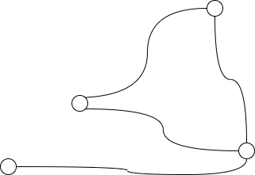
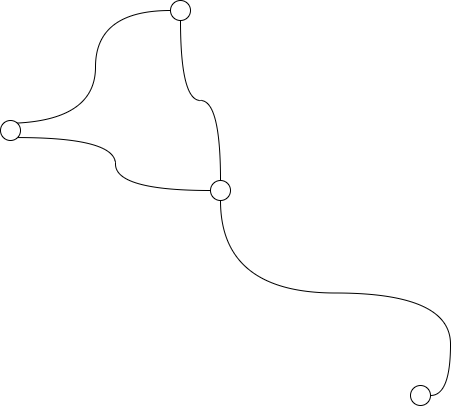
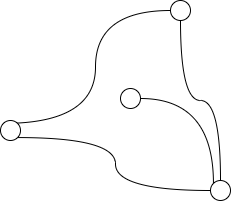
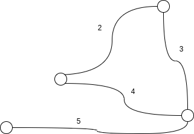
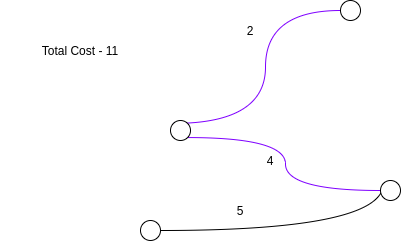
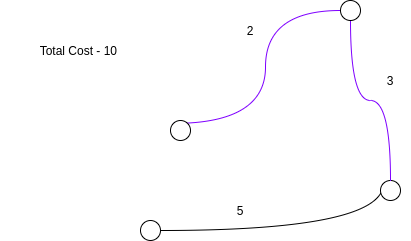
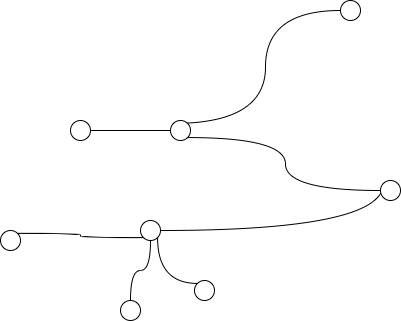
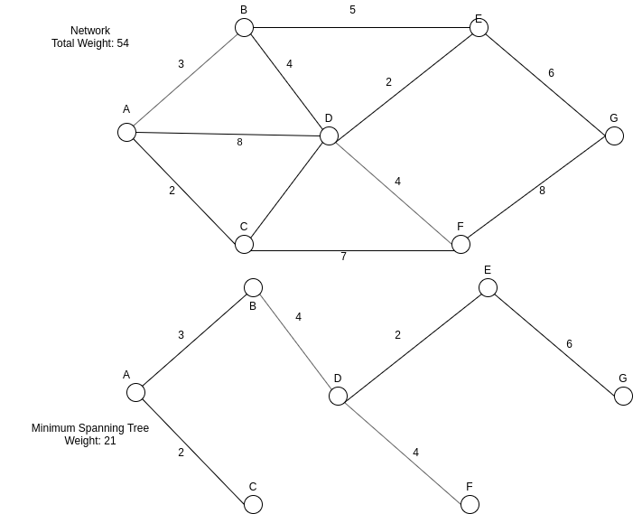

TL;DR - Today we are investigating networks. Prim's algorithm finds the cheapest way to connect a number of points together such that every point can be reached on a journey from every other point, in only one way - there are no loops in the graph produced. This type of graph is called a minimum spanning tree. When implementing the algorithm, you will want to use an OOP approach which either centres around Vertex (recommended) or Edge (more difficult) objects. In Prim's algorithm we start by picking a random point, then connecting it to the nearest point possible. Then, until we have a completed tree involving all points, we choose the next cheapest edge possible and connect that to the graph. The process is repeated until a succesful tree is produced.
<h1>Day 6</h1>
<h2>Prim's Algorithm</h2>

Having finally reached the end of the GCSE searching and sorting algorithms, and finishing on the challenge of Merge Sort, an algorithm which is very commonly used in the real world, let's reward ourselves with a look at a simple algorithm from Graph Theory and networks.

The source of today's algorithm is the "Network's, Pair 2" sheet, produced by the Advanced Maths Support Program for their competition Maths Feast 2019. (https://amsp.org.uk/resource/maths-feast-materials)

In the coming days, we will be taking a look at both Djikstra's Algorithm for finding the shortest path on a graph, and the A* (Graph) Search Algorithm. For this reason it is crucial that we get an understanding of how to represent networks/graphs inside our computer programs.

We are going to do this today with the DJP Algorithm, discovered independently by Djikstra, Jarnik and Prim in 1959, 1957 and 1930 respectively, which is often also called Prim's algorithm. Once we understand the terminology used and how to represent a network inside a computer, we should find it an easy introduction to network theory, but one that has real world applications.

<h3>Terminology</h3>

In Graph Theory we make reference to a number of terms which are used differently in many cases to their common usage outside of this sector:
<table>
<tr><th>Term</th><th><Definition</th></tr>
<tr><td>Node/Vertex</td><td>A single point which makes up a graph when connected to others by edges. Unlike points on x/y graphs, these nodes do not have a given position, just a relationship to other nodes.</td></tr>
<tr><td>Edge</td><td>A straight line or curve connecting two vertices to each other to form a graph. In a network, these edges are given weights, which are numbers that represent 
<tr><td>Graph</td><td>A collection of nodes/vertices and edges, with the edges joining up the vertices.</td></tr>
<tr><td>Network</td><td>A graph where all of the edges are labelled with a number, which usually represents something about this connection in reality (as these networks are often simplified representations of real networks.) We might put a value representing the speed of internet connection, or the length of underground train tunnel between two houses or metro stations for example.
<tr><td>Walk</td><td>According to the AMSP: "A sequence of vertices where consecutive vertices are joined by an edge in a graph", so a route around a given graph.</td></tr>
<tr><td>Cycle</td><td>According to the AMSP: "A walk which starts and finishes at the same vertex, without repeating any other vertex."</td></tr>
<tr><td>Weight</td><td>What converts a graph into a network - a numeric label attatched to an edge, which represents something about that edge, usually the favourability of it.</td></tr>
<tr><td>Tree</td><td>According to the AMSP: "A connected graph containing no cycles". This means that there is only ever one way to get between two given points, which isn't necessarily true of a normal graph. A tree always has one more edge than it does vertices</td></tr>
<tr><td>Minimum Spanning Tree</td><td>For any given graph, we can select a number of edges to form a tree, deleting the others to remove cycles. A minimum spanning tree is the result when we select the edges giving the lowest possible total weighting for the whole tree. This means it is the optimal way to connect up all of the nodes if a lower weight reprsents a more favourable outcome. https://en.wikipedia.org/wiki/Minimum_spanning_tree</td>
</table>

If you have studied neural networks and machine learning, you will recognise that a neural network is a simply a type/subtype of a network used to perform a specific tasks. We have nodes which are the neurons and weights, which are stored in the parameter vector, usually labelled theta.

Before we proceed with the algorithm, let's take an (deliberately simplified) example to familiarise ourselves with these concepts. We will use this graph:



Because nodes don't have to have a defined position, certain graphs are equivalent:



"

This equivalence allows us the possibility of a level of abstraction when representing graphs in computers, because we don't need to worry about the positioning of the points, only the links between them. 

The above two graphs are equivalent to the original graph. Hopefully you can see this.

A graph becomes a network via the addition of weights to its edges:



From this network, there are two trees we could create, since there is one cycle that can be removed in two different ways:

 

The network above right is the minimum spanning tree for the original network because out of all of the possible options, just two, this one has the lowest weight. 

You may have noticed that both of the above two trees can be simplified to a line of points. Note that this does not have to be the case for a tree, which can have more than two edges attached to a given vertex:




This equivalence allows us the possibility of a level of abstraction when we represent graphs in computers, because we don't need to worry about the positioning of the points, just the links between them


<h3>Representation</h3>
*There are several ways to achieve the task of representing  a network on a computer, but here is are two relatively simple ones. Feel free to skip this step if you want the challenge of working it out yourself.

In order to represent the networks we are working with on a computer, we will need to label each of the vertices of a given network with letters. This will permit us to reference edges as "AB" for example, which denotes an edge joining A to B.

Because we are dealing with representations of real world objects, it makes sense to opt for an object-oriented programming (OOP) Approach to solve this problem.

I would suggest that you use a dictionary/struct/object (select applicable for language) to represent an edge or vertex. We don't really need to do both, as the other type can just be represented as a reference to another of the same type. I think the vertex method will be simpler in the context of this algorithm, but I recommend reading both and then deciding upon your favourite, as we cannot decide when uniformed, and you might need the other one for later as well.

<h4>Vertices</h4>
Having labelled each vertex with a letter, we represent each of them as an object with 1 property, connections, which is an array representing all of the connecting edges that link to this vertex.
However, we still haven't linked the vertices to the letters. You would do this with a dictionary, or another property inside each vertex representing its number.

```Python
class Vertex():
	def __init__(self,connections):
		self.connections = connections

firstOne = Vertex([])
secondOne = Vertex([])
firstOne.connections.append([secondOne,4.5])
secondOne.connections.append([firstOne,4.5])
lettersToVertices = {'A':firstOne,'B':secondOne} #for example
```

You will need to work out how to get the user to input the network they have drawn into the program. This could be quite a challenge. I would suggest that for this approach:

```
Ask the user for the number of vertices in the graph
Use an alphabet variable to find out the letters that would label these vertices (from A up to alphabet[vertices-1])
lettersToVertices = {}
vertices = []
For each vertex label we just found: 
	create a Vertex object that represents this vertex
	lettersToVertices[currentLabel] = vertex we just created
	append the current vertex that we just created to the vertices array so you have a list of all vertices
For each Vertex object in the vertices array:
	Ask the user to input how many other vertices connect to this one
	FOR i=1 TO number_of_connections:
		Ask the user which other vertex is connected by the edge you are currently asking about
		Use the lettersToVertices dictionary/JSON object/whatever structure you chose to use to convert this to a Vertex object
		Ask the user for the weight of this edge
		Append to both of these objects the connection that they share, as a two element array: [otherObject,weight]
```

In the above you can always substitute user input for reading from a file of course, which would speed up the process of entering a network, as long as you use a consistent order of vertices (probably alphabetical).

You should now have a complete network representation inside the computer in the vertices array. You can check this is right by drawing a set of random points and labelling them A to the final letter, then joining up the correct vertices. Now check that the graph you have created is equivalent to the graph that you were trying to make. You could use draw.io to perform this check, or MS Paint. These tools would allow you to move the points around.


<h4>Edges</h4>
Having labelled each vertex with a letter, we represent each edge as an object with two properties, joins and weight. Joins represents the two vertices joined by this edge, which could be represented as a string or as a list, while weight is a real number value representing the weight of the edge. For example:

```C
typedef struct {
	char joins[2];
	float weight;
} edge; #This is a bit OOP-esque as you can then create several edge objects each with their own joins and weight values:
edge firstOne;
firstOne.joins = {'A','B'};
firstOne.weight = 5.4;
```

```Python
class Edge():
	def __init__(joins,weight):
		self.joins = joins
		self.weight = weight

firstOne = Edge("AB",5.4)

#Or you can do it with a dictionary:

firstOne = {"joins":"AB","weight":5.4} #Shorter for one but increasingly long by comparison to the OOP approach as you have to name the properties each time.
```

As mentioned above, you can use an object-oriented approach to this task, creating a class (or a prototype I think in JS) which represents an edge, then creating each edge individually based on that prototype. This will be easier to understand and follow, but since these objects don't really need methods (they only really have properties), we are closer to procedural programming with dictionaries/structs/objects..

You will need to work out how to get the user to input the network they have drawn into the program. This could be quite a challenge. I would suggest:

```
Ask the user for the number of vertices in the graph
Use an alphabet variable to find out the letters that would label these vertices (from A up to alphabet[vertices-1])
possible_edges = use combinations/permutations to work out all possible edge labels/vertex pairs.
Create an array, edges = []
For each edge label in possible_edges :
	Ask the user for the weight of this edge
	If the user doesn't enter a weight:
		Assume that this edge is not in the network (as not all vertex pairs will be connected directly) and move to the next edge label
	Otherwise:
		Create an Edge object or a structure type edge, however you have done it, with the current edge name and the weight entered by the user.
		Append this object to the edges array so that at the end this array contains all edges in use with their weights
		#You can do these two in one go and then you don't have to name the structure - like array.append(Edge("AB",4.5)) instead of a = Edge("AB",4.5); array.append(a)
```
In the above you can always substitute user input for reading from a file of course, which would speed up the process of entering a network, as long as you use a consistent order of vertices (probably alphabetical).

You should now have a complete network representation inside the computer in the edges array. You can check this is right by drawing a set of random points and labelling them A to the final letter, then joining up the correct vertices. Now check that the graph you have created is equivalent to the graph that you were trying to make. You could use draw.io to perform this check, or MS Paint. These tools would allow you to move the points around.


<h3>Algorithm</h3>
Here is Prim's Algorithm, as described by the AMSP

```

minimum_spanning_tree = []
Select any vertex on the network (would probably just do A)
Choose the lowest weight edge involving this vertex. (Either loop through all edges and check if they involve this vertex using a substring check, or if you did vertices you can simply loop through the edges property of all of the connected vertices. This will be thus a bit more efficient. In both cases keep track of the minimum so far as you iterate.)
Make the connection by appending this vertex to the minimum_spanning_tree array variable
While some vertices have no connections: #You would probably keep track of this by an array: ['A','B','C','D']  - remove the vertices when connected, then exit the loop when the array length is 0.
	Loop over all edges involving points that have already been connected, and choose the lowest weighted one that connects a new vertex. #This is essentially the same as line 3, so you will probably find that vertex representation is more logical.
```


If you are using the Vertex method, you could give each vertex a boolean property representing whether or not it has been added to the minimum spanning tree yet. 


<h3>Task</h3>
<ol>
<li>Implement a representation of networks on your computer with your chosen programming language using the instructions above.</li>
<li>Implement Prim's Algorithm using the instructions above also.</li>
</ol>

<h3>Tests</h3>
For this algorithm, writing a succinct and effective test may be challenging. You could use the diagrams above for your first test, picking some letters to label the vertices with.

For a second test, here is a network provided by the AMSP, along with its corresponding Minimum Spanning Tree. To find out how this was generated, check the Maths Feast 2019 Comprehension Poster Pair 2, which can be found in the Zip file linked at the top of the page.



You will likely want to run both of these tests at stages 1 and 2, so it may be worth investing the time required to implement file reading for the input of this data.

<h3>Extensions</h3>
Just a few extensions today as I imagine it will take a while to implement all of this. 
<ul>
<li>This will be quite challenging. Use a graphing library or API to draw the networks that you input into the program, generating coordinates and lines for the vertices and edges respectively, in order to produce an image of the network. This will be rewarding and a useful test of the effectiveness of the graph input code, and the minimum spanning tree code. Implement this as a function so that any array of edges can be plotted as a network.</
<li>Think about possible applications of Prim's Algorithm and minimum spanning trees, and try to use one to test your program, making a network based on a map, for example. This will be good practice for abstracting away detail from images and problems.</li>
<li>Having implemented the algorithm, try to work out its time complexity, by counting the number of statements executed/iterations performed. Since we essentially loop over all points that we want to add, it should be easy to work out the complexity by multiplying nested loops together. This will depend on your implementation so you should make the algorithm first.</li>
<li>Consider the different network topologies studied at GCSE (Ring, Star, Bus). Do these work out to be trees? Are they minimum spanning trees? Why/why not?</li>
<li>How could we apply networks/this algorithm to the current crisis?</li>
</ul>

<h3>Hints/Extension Answers</h3>
1. I would recommend matplotlib for Python/HTML Canvas for JS. If you have used MATLAB/Octave in the past, use it for this one as it makes plotting points and lines so much easier. You may find that you have to sort of convert your network to an x/y graph in order to allow you to plot it. Maybe you want to start by trying a library written for your chosen language that plots networks/graphs and adapt it.

2. Tube maps (how can we connect all of the stations the most cheaply/quickly?), Computer Networks (How can we connect all of the computers the most cheaply/quickly), networks of animals (how could we easily improve biodiversity and species interdependence?), networks of people (social or business networks), football strategies (you need to link everyone on the pitch in the way that allows the ball to travel the fastest, for example. Weights depend on the attributes of your players and what you are trying to maximise), among many others.

3. Check this link for more information: https://isaaccomputerscience.org/topics/complexity

4. We cannot categorically state that these networks are minimum spanning trees, since this depends on the individual implementation and the weights assigned to each connection, however both Star and Bus be considered trees since there are no cycles in these networks. Evidently, a Ring network is just one massive cycle, so it isn't really a tree as there are two ways to get between any two given points on the network.

5. If we want to map out the ease of transmission of viral diseases from person to person, with the weights corresponding to the likelihood of transmission, we could work out the best and worst case scenarios of a certain strategy in terms of transmission prevention.


